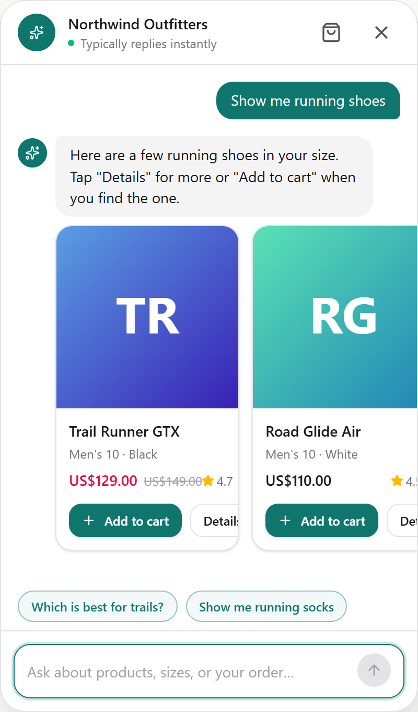
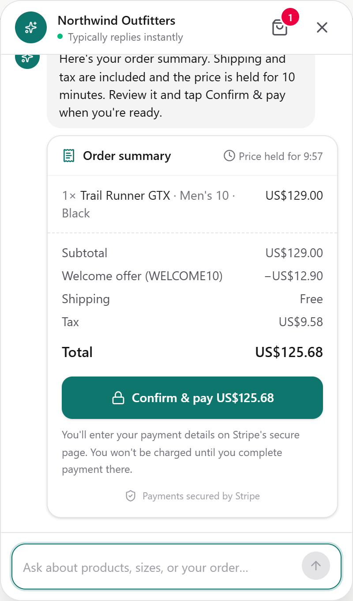
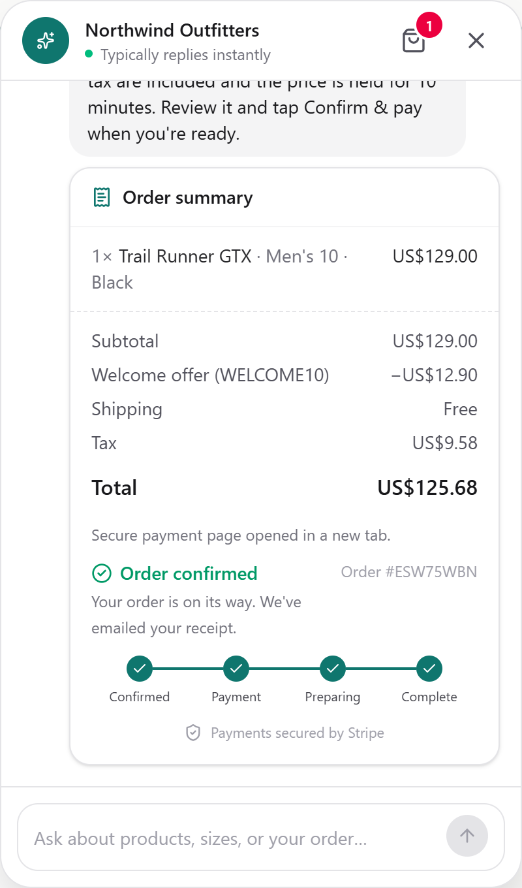
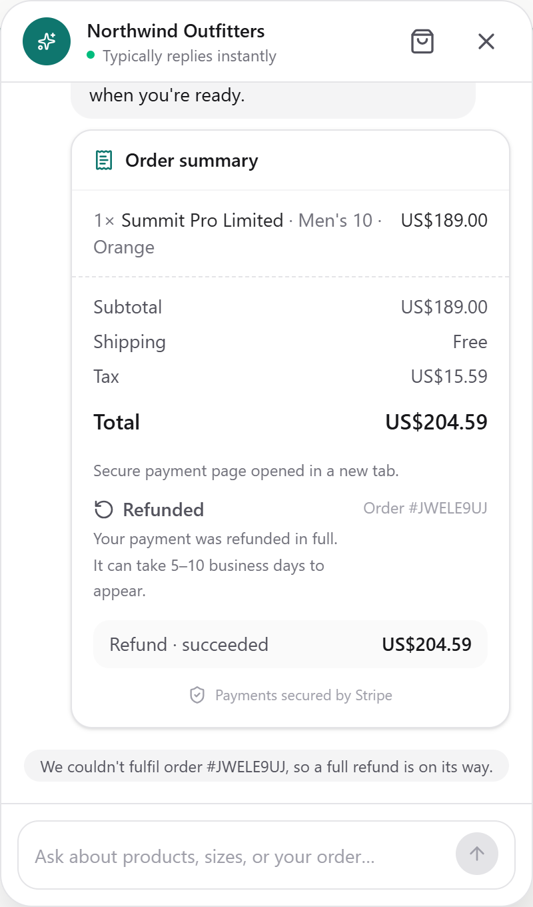
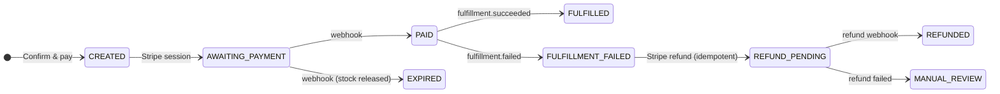
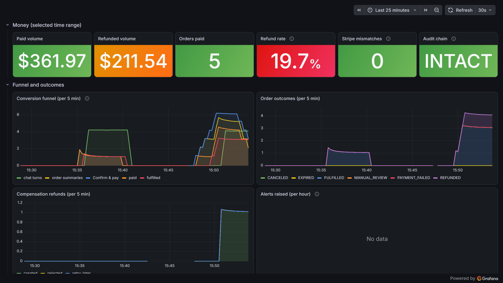

# Conversational Commerce & Checkout Agent


An AI shopping assistant that any online store can embed with one `<script>` tag. Shoppers chat to find
products, build a cart, apply promo codes and pay through Stripe, without leaving the page.

**The problem it solves:** letting an LLM take part in a purchase is risky. Models can get prices wrong,
invent discounts, or trigger a charge nobody approved. In this project the agent **can only suggest
actions**. Prices, tax and currency conversion come from the backend. A charge happens only after the
shopper clicks **Confirm & pay**. Every step that involves money is idempotent, driven by Stripe
webhooks, and recorded in an audit log that can't be edited.

**Who it's for:** engineers building agentic or payment systems, and anyone who wants a reference for
running an LLM safely next to real money.

## Screenshots

| Browse by chatting | Confirm an exact, server-priced quote | Track the order to completion | Automatic refund if it can't ship |
|:---:|:---:|:---:|:---:|
|  |  |  |  |

## How it works


Order status changes only when Stripe or the warehouse reports something, never because the model says so:



**What the design guarantees:**

- **The agent can't charge anyone.** The model sees only the tools allowed at each step. It never gets a
  payment tool. A charge needs a single-use confirmation grant that only the shopper's click can redeem.
- **Correct amounts.** Every price in a reply is checked against backend data. The Stripe amount equals
  the confirmed quote, to the cent.
- **No double charges or double shipments.** Payments use deterministic idempotency keys
  (`pay:{order_id}:v1`), webhooks are de-duplicated by event id, and each event is processed once.
- **No lost events.** Events are written in the same database transaction as the state change, then
  published. Messages that keep failing go to a dead-letter queue instead of being dropped.
- **Failures are compensated.** If a paid order can't be fulfilled, it is refunded in full
  automatically, and the refund is recorded in the audit log.
- **Nothing drifts silently.** A reconciliation job compares orders with Stripe, replays missed
  webhooks and flags mismatches. Orders that need a person trigger an alert (Slack-compatible webhook).
- **Tamper-evident history.** The audit log is hash-chained, and a database trigger blocks updates and
  deletes. Reconciliation re-verifies the chain.
- **Guarded input and output.** Deterministic rules plus Llama Prompt Guard screen messages for prompt
  injection. Replies are checked against what actually happened: prices, promo codes, and claims such as
  "added to your cart" or "you've been charged" must be backed by a tool result, and leaked secrets or
  prompt text are replaced.

The full architecture is in [docs/SYSTEM_DESIGN.md](docs/SYSTEM_DESIGN.md).

## Observability

Two Grafana dashboards are set up automatically (`--profile observability`): business and money, and
reliability and the agent. Prometheus alert rules cover refund failures, Stripe mismatches, dead letters,
backlogs, audit-chain tampering and LLM error spikes.



## Tech stack

| Area | Tools |
|---|---|
| Agent / LLM | LangGraph, LangChain-Groq (`gpt-oss-120b`, fallback `qwen3.8-27b`), Llama Prompt Guard 2 |
| Backend | Python 3.13, FastAPI, Pydantic v2, SQLAlchemy 2 (async), Alembic |
| Payments | Stripe Checkout, signed webhooks, Stripe CLI for local forwarding |
| Data & messaging | PostgreSQL 18 (one database per service), Redis 8, RabbitMQ 4 (quorum queues) via FastStream |
| Frontend widget | React 19, Redux Toolkit, Tailwind CSS 4, TypeScript, Vite, Shadow DOM web component |
| Infrastructure | Docker (multi-stage, non-root images), Docker Compose, Traefik 3 |
| Quality | pytest + Testcontainers, Hypothesis, Schemathesis, Vitest + MSW, ruff, mypy (strict), GitHub Actions |
| Observability (optional) | OpenTelemetry, Prometheus, Grafana, Jaeger, structlog |

## Getting started

### Try the widget in one minute (no keys, no Docker)

The widget ships with a scripted mock backend, so you can try the UI on its own:

```bash
cd widget
npm ci
npm run dev          # open http://localhost:5173
```

### Run the full system

**Prerequisites:** Docker Desktop, Python 3.13+, Node 22+, [uv](https://docs.astral.sh/uv/), a free
[Groq API key](https://console.groq.com/keys) and a [Stripe test-mode account](https://dashboard.stripe.com/test/apikeys).

1. **Clone the repo and create your `.env`.** The script generates every internal password, key and
   secret:

   ```bash
   git clone <repo-url> && cd <repo-folder>
   python scripts/init_env.py
   ```

2. **Add your own keys to `.env`:** `GROQ_API_KEY`, `STRIPE_SECRET_KEY` (`sk_test_…`) and
   `STRIPE_PUBLISHABLE_KEY` (`pk_test_…`). Set `VITE_USE_MOCKS=false` so the widget talks to the real
   backend.

3. **Get the webhook signing secret** and paste it into `.env` as `STRIPE_WEBHOOK_SECRET`:

   ```bash
   docker compose --profile dev-tools run --rm stripe-cli listen --print-secret
   ```

4. **Start everything.** This runs migrations, seeds a demo catalog and starts all services:

   ```bash
   docker compose --profile app --profile dev-tools up -d --build
   docker compose ps    # wait until the services show "healthy"
   ```

5. **Open the widget:**

   ```bash
   cd widget && npm ci && npm run dev    # http://localhost:5173
   ```

| URL | What |
|---|---|
| http://localhost:5173 | Demo storefront with the widget (dev server) |
| http://localhost:8088 | Public entry point (Traefik → gateway, widget bundle) |
| http://localhost:15672 | RabbitMQ management UI |

Add `--profile observability` to the `up` command to also start Grafana (http://localhost:3001) and
Jaeger (http://localhost:16686).

## Usage

### Shop by chatting

Try messages like:

```text
Show me running shoes
Add the Trail Runner GTX to my cart
Apply WELCOME10
Check out and ship to 1 Main St, Austin, TX 78701, USA
Where is my order?
```

Press **Confirm & pay** and pay on Stripe's test page with card **4242 4242 4242 4242**, any future
expiry date and any CVC. The order tracker moves through *Payment received → Preparing → Complete*
within a few seconds.

**See the automatic refund:** buy **Summit Pro Limited**. The demo warehouse is set to refuse it
(`FULFILLMENT_MOCK_FAIL_SKUS` in `.env`), so a few seconds after you pay, the order shows **Refunded**.
The refund is visible in your Stripe test dashboard.

### Embed it in your store

Serve the built bundle and add one tag to any page whose origin is listed in `WIDGET_ALLOWED_ORIGINS`:

```html
<script src="http://localhost:8088/widget/commerce-chat.js"
        data-publishable-key="pk_widget_demo_123"
        data-gateway-url="http://localhost:8088"
        data-brand-color="#0f766e" async></script>
```

Other options: `data-theme` (`light`/`dark`), `data-position` (`left`/`right`), `data-open-on-load`,
`data-merchant-name`. You can also control it from JavaScript:

```js
window.CommerceChat.open();
window.CommerceChat.close();
```

### Run the tests

```bash
uv sync --all-packages
uv run pytest                    # unit, property, contract, API-fuzzing and chaos tests (needs Docker)
uv run pytest evals/offline      # guardrail evals (deterministic, gate CI)
uv run pytest evals/live         # agent evals on real Groq (reads GROQ_API_KEY)
uv run ruff check . && uv run mypy libs/common/src services/*/src
cd widget && npm test && npm run contracts:check
```

Against the running stack:

```bash
python scripts/chaos.py          # pause RabbitMQ, kill workers, stop services mid-flow; check invariants
FUZZ_EXAMPLES=300 uv run pytest -k api_fuzz   # deeper API fuzzing
```

If you change an API or event on purpose, regenerate the contract snapshots with
`uv run python scripts/export_contracts.py` (and `npm run contracts` in `widget/`) and review the diff.

## Project structure

```text
├── libs/common/          Shared Python library: money, auth, events, outbox/inbox messaging
├── services/
│   ├── gateway/          Public API for the widget: sessions, SSE streaming, rate limits
│   ├── agent/            LangGraph agent, Groq models, tools, guardrails
│   ├── commerce/         Catalog, carts, pricing, promotions, tax, stock reservations
│   ├── checkout/         Confirmations, orders, Stripe, webhooks, audit log
│   └── fulfillment/      Consumes paid orders, calls the warehouse, reports the result
├── widget/               Embeddable React chat widget (organised by feature)
├── docker/               Shared multi-stage Dockerfile for the Python services
├── infra/                Postgres init scripts, observability config
├── contracts/            Published API/event schemas, contract and fuzzing tests
├── evals/                Offline and live agent evals (datasets, scorecards)
├── scripts/              init_env.py, chaos.py, export_contracts.py, build_dashboards.py
└── docs/SYSTEM_DESIGN.md Architecture and design decisions
```

All configuration lives in one file, `.env`. [`.env.example`](.env.example) documents every variable.

## Roadmap

- [x] Catalog, carts, server-side pricing, promotions and tax
- [x] LangGraph agent on Groq with guardrails
- [x] Explicit confirmation, Stripe Checkout, webhook-driven order state, audit log
- [x] Fulfilment over RabbitMQ (transactional outbox / inbox)
- [x] Automatic Stripe refund when fulfilment fails, with the refund recorded in the audit log
- [x] Reconciliation against Stripe and alerts (manual review, stuck orders, dead letters, audit tampering)
- [x] Hardening: guardrails, eval suite in CI, contract tests, API fuzzing, chaos tests, dashboards
- [ ] Live order updates pushed to the widget (it polls today)
- [ ] Telegram channel (built, currently disabled)

## License

Released under the [MIT License](LICENSE).
