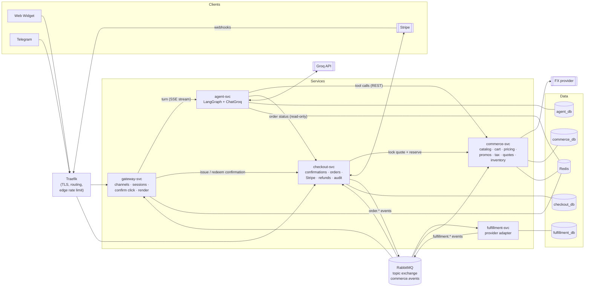
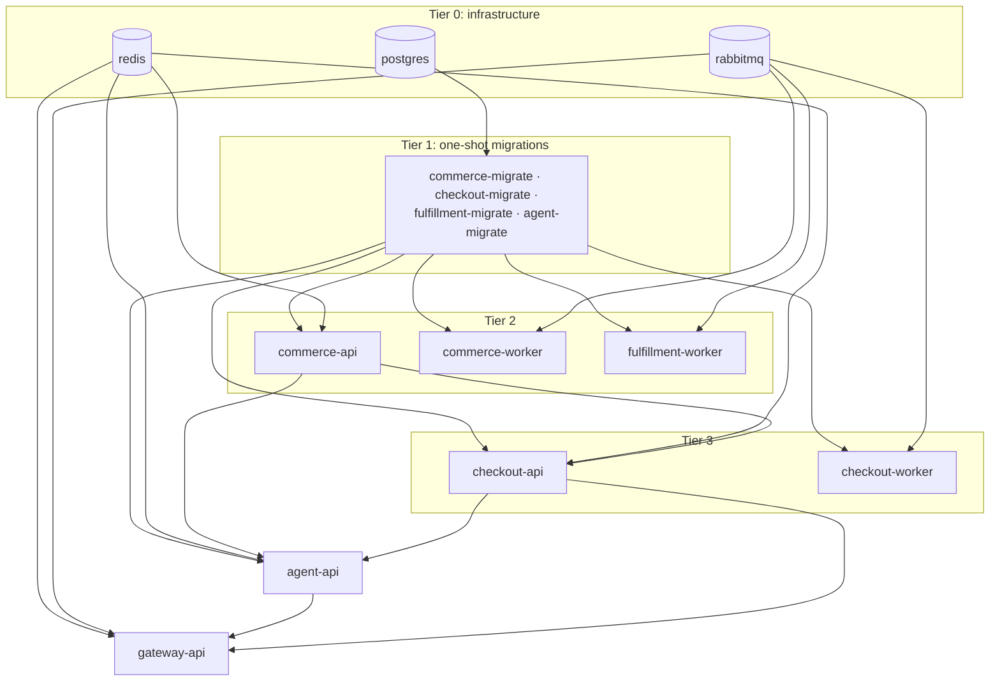
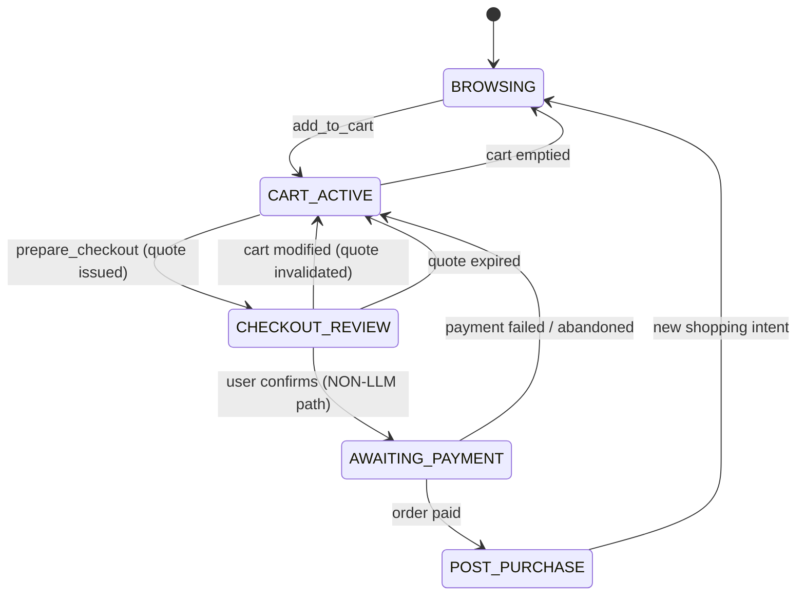
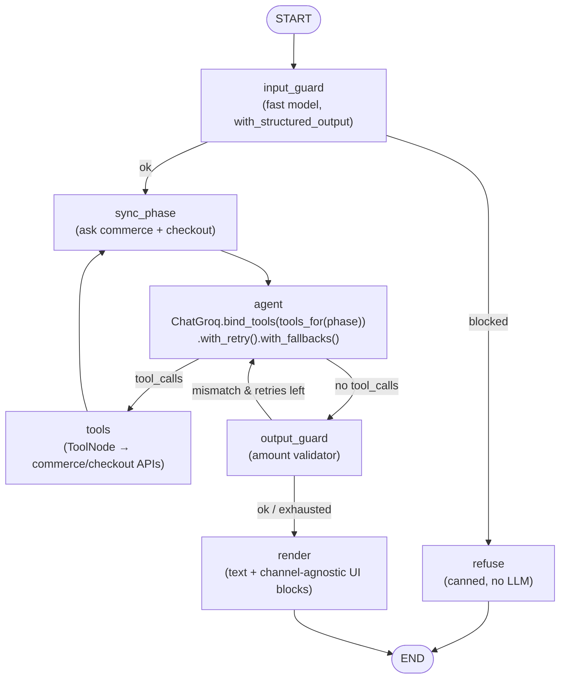
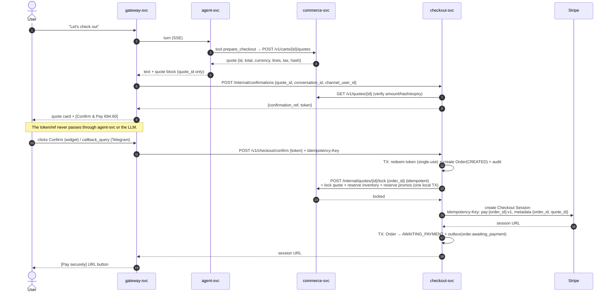
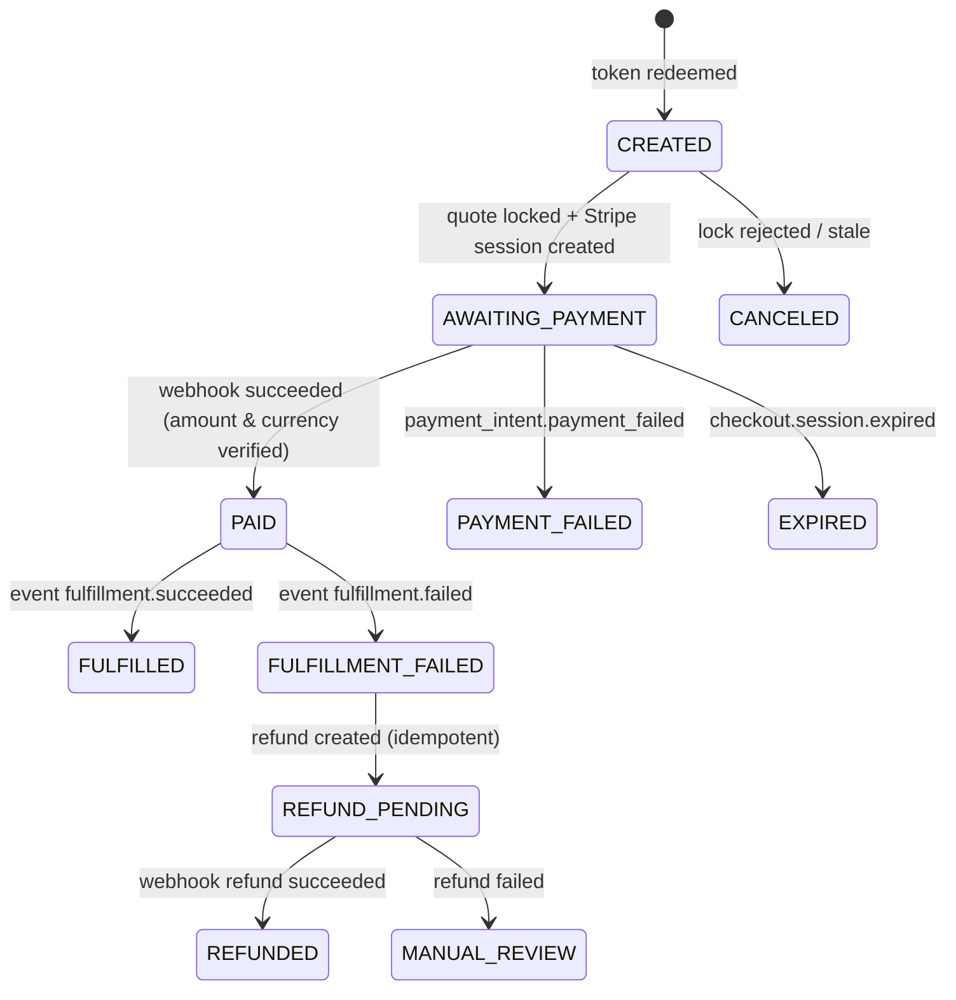
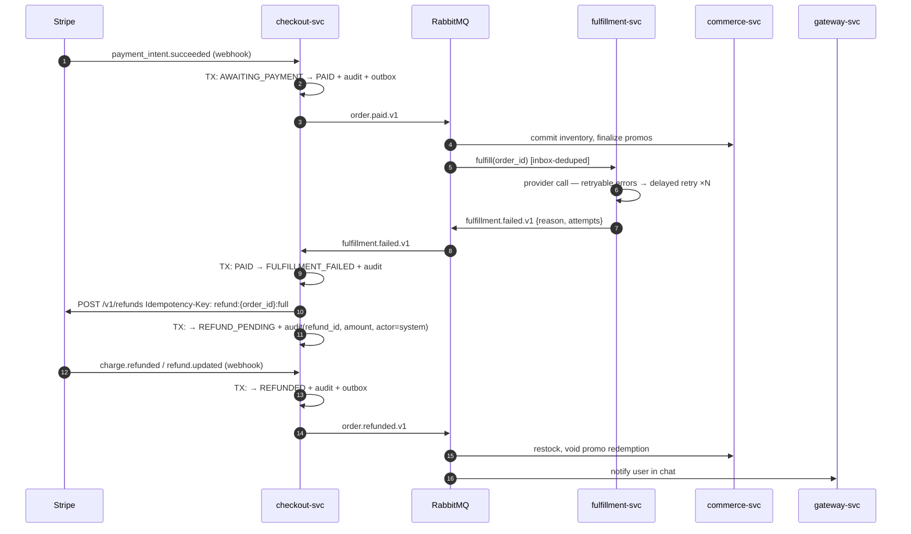

# Conversational Commerce & Checkout Agent: System Design (High Level)

> Status: v0.9 · 2026-09-25 · Architecture: microservices · **M1–M5 implemented** (§18–§22)
> Scope: Architecture, the rules that must always hold, service boundaries, data flows, and the reliability model. How each part is built comes later.

---

## 1. Problem Statement

We are building a chat agent that can be embedded in any storefront (a web widget, or a Telegram bot for messaging). It can:

1. **Browse** a product catalog in natural language ("waterproof running shoes under $120 in size 10").
2. **Build and edit carts** ("swap the blue one for black, add two pairs of socks").
3. **Apply promotions** (codes plus automatic promotions the customer qualifies for).
4. **Check out** by creating a Stripe Checkout Session or a PaymentIntent, **only after the user explicitly confirms**.
5. **Track the order afterwards** (status, receipts, and refunds when fulfillment fails).

The hard part is not the chat. It is making sure that **a probabilistic model can never cause a wrong, duplicate, or unauthorized financial action**, even when the work is split across services that talk over a network that can fail.

---

## 2. Design Principles (Non-Negotiables)

| # | Principle | What it means in practice |
|---|-----------|---------------------------|
| P1 | **The LLM proposes, the backend decides** | The LLM only picks tools and fills in their arguments. Every price, tax, discount, total, currency, and state change is computed and checked by deterministic backend code. |
| P2 | **No money moves without explicit user confirmation** | The confirmation comes from the user through a path the LLM cannot reach: a button in the web widget, or a Telegram inline-keyboard button. The LLM has **no tool** that charges a card. The agent service also **has no Stripe credentials and no permission** to call confirm or charge endpoints. |
| P3 | **Every side effect is idempotent** | Our endpoints take `Idempotency-Key`. Every Stripe write call uses a deterministic idempotency key. Webhooks are de-duplicated by `event.id`. Message consumers are de-duplicated by `message_id`. |
| P4 | **Webhooks are the source of truth for payment state** | A redirect or a message saying "payment succeeded" is never trusted. Orders change state only when a signed Stripe webhook arrives. |
| P5 | **Failures are compensated, not ignored** | If payment succeeds but fulfillment fails, the system refunds automatically (saga pattern). Every step is written to the audit log. |
| P6 | **Money is integers plus an ISO-4217 currency code** | Never floats. Rounding rules are explicit and depend on the currency (JPY has 0 decimal places, USD 2, KWD 3). |
| P7 | **Everything is observable and auditable** | One correlation ID follows a request across services: chat message → LLM → tool → service call → event → Stripe → webhook. The audit log is append-only and hash-chained. |
| P8 | **Config lives in the environment** | All configuration comes from one `.env` file (§13) and is validated at startup, which fails immediately if anything is invalid. Each service receives **only the variables it needs**. |
| P9 | **Each service owns its data** | No service reads another service's database. Services communicate only through versioned APIs and events. |

---

## 3. Service Architecture

### 3.1 Why microservices, and why only five

We split the system where there is a **real reason**: a trust boundary, a different way of scaling, or a separate failure domain. We don't split just to have more services:

| Reason | Where it shows up |
|--------|-------------------|
| **Trust boundary** | Only `checkout-svc` holds Stripe secrets. The LLM runs in `agent-svc`, which is physically unable to create a charge. |
| **Different scaling profile** | `agent-svc` is limited by how many LLM calls can run at once. `gateway-svc` is limited by open connections (SSE). `checkout-svc` handles little traffic but is critical. |
| **Failure isolation** | A Groq outage or an agent bug can't block Stripe webhooks, refunds, or reconciliation. |
| **Consistency boundary** | Cart, pricing, promotions, tax, and quotes must produce one atomic snapshot, so they live together in `commerce-svc`. Confirmation, orders, payments, and audit must change together, so they live together in `checkout-svc`. |

We deliberately do **not** split pricing, promotions, tax, or the cart into their own services. That would put a distributed transaction in the path every quote takes, for no benefit.

### 3.2 The Services

| Service | Owns | Data store | Exposed publicly? |
|---------|------|-----------|-------------------|
| **gateway-svc** (channel gateway / BFF) | Web widget API (SSE), Telegram webhook, session JWTs, rate limiting, rendering UI cards per channel, the **Confirm & Pay** click endpoint, proactive notifications ("your order shipped / was refunded") | Redis (sessions, rate limits, `update_id` de-duplication) | Yes (via Traefik) |
| **agent-svc** | LangGraph agent, ChatGroq tool calling, guardrails, conversation memory | `agent_db` (LangGraph checkpoints, transcripts, `tool_invocations`) + Redis (one-turn-at-a-time lock per conversation) | No |
| **commerce-svc** | Catalog and search, inventory and reservations, carts, pricing and FX, promotions, tax, quotes | `commerce_db` (+ pgvector, pg_trgm) + Redis (cache) | No |
| **checkout-svc** | Confirmations, the order state machine, the Stripe adapter, Stripe webhooks, refunds, the compensation saga, reconciliation, the audit log | `checkout_db` | **Only** `POST /webhooks/stripe` (via Traefik) |
| **fulfillment-svc** | Fulfillment provider adapter (mock or 3PL), retries, and reporting whether fulfillment succeeded or failed | `fulfillment_db` | No |

Each service is built into **one image and run as two processes**: `api` (FastAPI) and `worker` (outbox relay, event consumers, scheduled jobs). `fulfillment-svc` only needs the worker plus a health endpoint.

### 3.3 Architecture Diagram



### 3.4 Communication Patterns

| Pattern | Used for | How we keep it reliable |
|---------|----------|-------------------------|
| **Sync REST (HTTP/JSON)** | Queries and user-facing commands that need an answer now: agent tools → commerce, gateway → checkout (confirm), checkout → commerce (lock quote) | `httpx` with strict timeouts. Retries (`tenacity`) **only** on idempotent calls, and always with an `Idempotency-Key`. Every call carries a correlation ID (W3C `traceparent`). |
| **Streaming (SSE over HTTP)** | gateway → agent turns (text chunks + UI blocks) | Backpressure and a turn timeout. If the stream is cut, the gateway shows a "your cart is saved" message. |
| **Async events (RabbitMQ)** | Anything that happens *after* payment: fulfillment, inventory commit/release, promotions, notifications, compensation | **Transactional outbox** in the producer, and an **inbox** (a de-duplication table) in the consumer. Quorum queues, a dead-letter exchange, and retry queues with delays. Event schemas are versioned (`order.paid.v1`). |

**Service-to-service authentication:** each caller holds its own API key in plain text. Each service being called holds only the **SHA-256 hashes** of the keys it accepts, and maps each one to the permissions (scopes) it allows. Because no service holds another service's plaintext key, no service can impersonate another. Examples:
- `agent-svc` → `commerce:read`, `commerce:cart:write`, `checkout:orders:read`
- `gateway-svc` → `agent:turns`, `checkout:confirmations:issue`, `checkout:confirm`
- `checkout-svc` → `commerce:read`, `commerce:quotes:lock`

The agent's key **cannot** call the confirm endpoint. In production, this becomes mTLS through a service mesh.

**Networks (Docker):** the `edge` network holds Traefik, gateway-svc, and checkout-svc (webhook route only). The `backend` network holds all services and infrastructure. Only Traefik publishes ports.

### 3.5 Service Dependency Graph & Startup Order

Synchronous dependencies form a **directed acyclic graph**: no service calls back into a service that calls it. Anything that would create a cycle (for example, commerce reacting to a paid order) goes through **events**, not calls.



| Container | Waits for (Compose `depends_on`) | Sync calls at runtime |
|-----------|----------------------------------|-----------------------|
| `*-migrate` | postgres **healthy** | none; runs `alembic upgrade head` (agent also runs `checkpointer.setup()`), then exits 0 |
| `commerce-api` | its migration **completed**, redis healthy | none (leaf service) |
| `commerce-worker` | its migration completed, redis + rabbitmq healthy | none |
| `fulfillment-worker` | its migration completed, rabbitmq healthy | fulfillment provider (external) |
| `checkout-api` | its migration completed, redis healthy, **commerce-api healthy** | commerce (quote read/lock), Stripe |
| `checkout-worker` | its migration completed, redis + rabbitmq healthy | Stripe |
| `agent-api` | its migration completed, redis healthy, **commerce-api + checkout-api healthy** | commerce (tools), checkout (read-only), Groq |
| `gateway-api` | redis + rabbitmq healthy, **agent-api + checkout-api healthy** | agent (turns), checkout (confirm) |

**Rules:**
- **Startup ordering is a convenience, not a guarantee.** `depends_on` only orders the *first* start. At runtime any dependency can disappear, so every service must still use timeouts and retry idempotent calls, and must degrade gracefully (for example, the gateway replies "your cart is saved, try again shortly").
- **Two health endpoints per API.**
  - `/health/live`: the process is up.
  - `/health/ready`: its **own** DB, Redis, and broker connections are OK.

  Readiness does **not** check other services. Otherwise one slow service would mark every service upstream of it unhealthy as well.
- **Migrations run as separate one-shot containers.** They are not run when an API starts, so scaled-out replicas never race to migrate the same schema.
- **Performance on the hot path:** each chat turn is `gateway → agent → commerce` (plus Groq). To keep that fast:
  - Every `httpx.AsyncClient` is long-lived and pooled, with keep-alive (no new TCP/TLS connection per call).
  - commerce caches catalog reads in Redis.
  - Tools return compact payloads.
  - Nothing *after* payment is synchronous: it is all event-driven, so slow fulfillment never adds latency to chat.

### 3.6 Components at a Glance (inside the services)

| Component | Service | Key reliability features |
|-----------|---------|--------------------------|
| **Web Widget**: a Web Component (Shadow DOM) that streams over SSE and draws cards, quotes, and the Confirm button from structured data | built as a static bundle | Only runs on origins in the allowlist. Uses short-lived session JWTs. The CSP forbids `eval`. |
| **Channel adapters**: web + Telegram (python-telegram-bot) → one `InboundMessage` format. Telegram `callback_query` (button presses) go to checkout, **never** to the agent. | gateway | Checks the Telegram secret-token header, de-duplicates by `update_id`, and rate-limits per chat and per session. |
| **Agent Orchestrator**: a LangGraph `StateGraph` that binds only the tools allowed in the current conversation phase | agent | `recursion_limit`, turn timeout, `with_retry`, `with_fallbacks`, and Pydantic checks on tool arguments. |
| **Guardrails**: input screening, and a check that every amount in the output matches a tool result | agent | Catalog text is treated as untrusted data. PII is redacted in logs. |
| **Pricing Engine**: explicit price books first, otherwise FX conversion from a stored rate snapshot | commerce | Integer minor units, rounding per currency. |
| **Promotion Engine**: eligibility, stacking rules, redemption caps | commerce | Redemptions are reserved when the quote is locked, finalized on `order.paid`, and released on expiry or refund. |
| **Tax Service**: a `TaxProvider` interface (static / Stripe Tax) | commerce | Tax is calculated only on the final quote. The LLM never computes it. |
| **Quote Service**: an immutable, hashed snapshot with a TTL | commerce | Locking a quote is **idempotent per `order_id`**. It locks the quote, reserves inventory, and reserves promotions in **one local transaction**. |
| **Confirmation Service**: a single-use token tied to (`quote_id`, `quote_hash`, `amount`, `currency`, `conversation_id`, `channel_user_id`) | checkout | Redeeming the token and creating the order happen in one DB transaction. Tokens are stored hashed. |
| **Payment adapter**: Checkout Sessions, PaymentIntents, Refunds | checkout | Deterministic idempotency keys and `metadata.order_id` on every Stripe object. |
| **Order State Machine**: the only authoritative order state | checkout | Optimistic locking. Invalid transitions are rejected (which handles events that arrive out of order). |
| **Audit Log**: append-only and hash-chained | checkout | The DB role has no `UPDATE`/`DELETE`. It also records `fulfillment.*` events it receives. |
| **Fulfillment worker**: calls the provider, classifies errors as retryable or terminal | fulfillment | Idempotent per `order_id`. Retries use delayed retry queues. |

---

## 4. Technology Choices (and Why)

| Concern | Choice | Rationale |
|---------|--------|-----------|
| Language / API | **Python 3.13 + FastAPI + Pydantic v2** (every service) | Async I/O, and one language across services. Pydantic models are the source for the API schema, the tool schema, and the event schema. |
| Agent orchestration | **LangGraph 1.x** (explicit `StateGraph`) + `langgraph-checkpoint-postgres` | Widely used in production. Explicit nodes and edges keep the safety rules visible. Conversation memory survives restarts. |
| Tool calling & LLM client | **LangChain 1.x + `langchain-groq` (`ChatGroq`)** | Standard `@tool` definitions with Pydantic `args_schema`, `bind_tools` per phase, `ToolNode`, `with_retry`/`with_fallbacks`, `with_structured_output`. |
| LLM inference | **Groq** | Very low latency matters in chat checkout. A primary model, a fallback model, and a fast guard model are all set in `.env`. |
| Telegram | **python-telegram-bot v21+** (async) | The most widely used Telegram library. Webhook mode inside FastAPI, polling mode for local dev. |
| Message broker | **RabbitMQ 4.x** (quorum queues, DLX) | Delivers each message at least once, with dead-lettering and routing by event type through a topic exchange. It is simpler to run than Kafka for command/event workflows at this scale. |
| Messaging framework | **FastStream** | Typed publishers and consumers built on Pydantic, native to AsyncAPI docs, and testable in memory. |
| Service HTTP client | **httpx + tenacity** | Async, timeouts, and retry policies only for idempotent calls. |
| API gateway / edge | **Traefik v3** | Routing, TLS, and rate limiting at the edge, configured through Docker labels. Exposes only the gateway routes and the Stripe webhook. |
| Database | **PostgreSQL 18 + pgvector** (one database per service) | ACID transactions for money, row-level locks, and full-text, trigram, and vector search for the catalog. In dev, one Postgres instance hosts 4 separate databases, each with its own role. In prod, each service gets its own managed instance. |
| ORM / migrations | **SQLAlchemy 2.0 (async) + Alembic** (per service) | Each service versions its own schema independently. |
| Cache / coordination | **Redis 8** | Rate limits, sessions, per-conversation turn locks, the idempotent-response cache, and the catalog cache. |
| Scheduled jobs | **APScheduler** in workers, with a Redis leader lock | Reconciliation and expiry sweeps run on exactly one replica. |
| Payments | **Stripe** (Checkout Sessions, PaymentIntents, Refunds, Stripe Tax) | First-class idempotency keys and a strong webhook model. |
| Observability | **OpenTelemetry → OTel Collector → Jaeger (traces) + Prometheus (metrics) + Grafana**, **structlog**, optional **LangSmith** | Traces that cross services via `traceparent` (in HTTP headers *and* RabbitMQ message headers). |
| Packaging | **Docker multi-stage builds (uv → python:3.13-slim) + Docker Compose** | One shared Dockerfile and one image per service, non-root and read-only. Compose starts services in dependency order with health checks. Core infra runs by default, plus profiles `app`, `observability`, `dev-tools`. |
| Testing | **pytest, testcontainers, FastStream TestBroker, Stripe test mode, hypothesis, schemathesis** | Property tests for money rules. Contract tests for APIs and events. |

Why a **single orchestrating agent** instead of a multi-agent swarm: when real money is involved, predictable behavior matters more than autonomy. Specialized sub-graphs (for example returns or support) can be added later behind the same tool contract.

---

## 5. The Agent Layer (agent-svc)

### 5.1 Conversation Phases → Tool Scoping



| Phase | Tools bound to the LLM | Backing service |
|-------|------------------------|-----------------|
| `BROWSING` | `search_products`, `get_product`, `list_eligible_promotions`, `add_to_cart` | commerce |
| `CART_ACTIVE` | above + `view_cart`, `update_cart_item`, `remove_cart_item`, `apply_promo_code`, `remove_promo_code`, `set_shipping_address`, `prepare_checkout` | commerce |
| `CHECKOUT_REVIEW` | `view_quote`, `update_cart_item` (invalidates the quote), `cancel_checkout` | commerce |
| `AWAITING_PAYMENT` | `get_payment_status` | checkout (read-only) |
| `POST_PURCHASE` | `get_order_status`, `search_products` | checkout (read-only), commerce |

**No tool exists that confirms, charges, or refunds.** `prepare_checkout` produces a quote. The confirmation token is issued afterwards by the **gateway** (§6.2), so the agent service never holds it.

### 5.2 Orchestration with LangGraph

The agent is an explicit LangGraph `StateGraph`, compiled once at startup with an `AsyncPostgresSaver` checkpointer (`thread_id = conversation_id`).



- **Graph state:** `messages` (with the `add_messages` reducer), `phase`, `guard_retries`, `turn_artifacts`, `turn_amounts`.
- **Runtime context** (never visible to the LLM): `merchant_id`, `conversation_id`, `cart_id`, `currency`, `channel`, `correlation_id`. The LLM can't choose the merchant, cart, or currency.
- **`sync_phase`** is deterministic. It works out the phase from the *services' actual state*: does the cart have items, is there a valid quote, is there an order? It never infers the phase from the LLM.
- **`tools`**: each LangChain `@tool` (with a Pydantic `args_schema`) is a thin HTTP client to commerce-svc or checkout-svc. Tools use `response_format="content_and_artifact"`: the LLM gets a short JSON summary, and the gateway gets the full structured block. HTTP 4xx responses from domain rules go back to the LLM as tool errors it can fix. Timeouts and 5xx responses become a graceful "try again" reply.
- **`render`** emits channel-agnostic blocks (`text`, `product_card`, `cart`, `quote`). The gateway turns them into widget events or Telegram messages.
- **How the loop is bounded:** `recursion_limit`, a turn timeout, `max_tokens`, and a Redis lock that allows one turn at a time per conversation.
- **Prompt-injection defense:** catalog text is wrapped as untrusted data. Even if an injection works, it gains nothing, because the service has no tool, key, or network permission that moves money.

### 5.3 Output Amount Validator

A deterministic validator pulls every currency amount out of the LLM's reply and checks it against the amounts in this turn's tool results. If an amount doesn't match, the reply is regenerated once. If it still fails, prices are removed from the text and only the structured card is shown. **The UI always draws prices from structured data, never from LLM prose.**

---

## 6. Checkout & Payment Flow

### 6.1 Money Pipeline (commerce-svc, never the LLM)

```
cart lines (sku, qty)
  → unit price  = PriceBook[sku][currency]  ?? convert(base_price, fx_snapshot) + currency rounding
  → line subtotal
  → promotions  (eligibility → stacking → per-line allocation, largest-remainder rounding)
  → shipping    (rate table by region/weight)
  → tax         (TaxProvider on final taxable lines + ship-to; inclusive vs exclusive by region)
  → total       (integer minor units)
  → Quote{ id, lines[], discounts[], tax_lines[], shipping, total, currency, fx_rate_id, expires_at, hash }
```

The presentment currency comes from the session, never from the LLM, and must be in `SUPPORTED_CURRENCIES`. The FX snapshot and the tax calculation are stored on the quote.

### 6.2 Explicit Confirmation Across Services



**If a step fails partway through (a small orchestrated saga inside checkout-svc):**
- **The lock is rejected** (quote expired, cart changed, out of stock) → the order goes to `CANCELED` and the user is asked to re-quote. No money has moved.
- **checkout-svc crashes between steps** → a sweeper picks up `CREATED` orders older than `ORDER_CREATED_STALE_SECONDS` and runs the steps again. Every step is idempotent (the lock is keyed by `order_id`, the Stripe call by `pay:{order_id}:v1`). Anything that can't be completed is canceled, and the inventory and promotion reservations expire through their TTL.

**Channel specifics:**
- **Web:** the widget's own button calls the gateway directly, not through the LLM.
- **Telegram:** an inline keyboard `[✅ Confirm & Pay €84.60] [✖ Cancel]`.
  - `callback_data` (limit: 64 bytes) holds only `cf:<confirmation_ref>`.
  - The gateway checks that `from.id` matches the conversation owner, calls `answerCallbackQuery`, and removes the keyboard so the button can't be pressed twice.
- **Typed "yes"/"confirm" messages never count as confirmation.**
- We deliberately **do not use Telegram's built-in Payments API**. Every channel pays through the same Stripe flow.
- **Saved payment method (one-click):** the same token is required. There is no way to charge without it.

### 6.3 Checkout Modes

| Mode | When | Notes |
|------|------|-------|
| **Stripe Checkout Session** (hosted) | Default for web, and the only mode for Telegram (as a URL button) | Stripe handles SCA and wallets. Least PCI scope. |
| **PaymentIntent + Payment Element** | Embedded payment in the widget | The `client_secret` goes to the widget only, never to the LLM or into logs. |
| **PaymentIntent with saved PM** | Returning customers | Always needs the confirmation token. |

---

## 7. Order Lifecycle, Events & Compensation

### 7.1 Order State Machine (checkout-svc)



Each transition is **one local transaction**: update `orders` (with a `version` check), insert `audit_log`, and insert `outbox`.

### 7.2 Event Catalog (RabbitMQ topic exchange `commerce.events`)

| Event (routing key) | Producer | Consumers → action |
|---------------------|----------|--------------------|
| `order.paid.v1` | checkout | fulfillment → fulfill · commerce → commit inventory, finalize promotions · gateway → notify user |
| `order.expired.v1`, `order.payment_failed.v1`, `order.canceled.v1` | checkout | commerce → release reservations · gateway → notify user |
| `fulfillment.succeeded.v1` | fulfillment | checkout → `FULFILLED` |
| `fulfillment.failed.v1` | fulfillment | checkout → start compensation |
| `order.refunded.v1` | checkout | commerce → restock and void promotions · gateway → notify user |
| `order.manual_review.v1` | checkout | alerting |

**Envelope** (CloudEvents-style): `id`, `type`, `source`, `time`, `correlation_id`, `traceparent`, `data`.
**Delivery:** the producer writes an outbox row in the same transaction as the state change, and a relay publishes it (with publisher confirms). The consumer inserts into an inbox table (`message_id` is UNIQUE), then handles the message, then acks. Failures go to delayed retry queues, and then to the DLQ plus an alert.

### 7.3 Stripe Webhook Processing (checkout-svc)

```
POST /webhooks/stripe   (only public checkout route)
  1. Verify Stripe-Signature (tolerance window)                 → 400 if invalid
  2. INSERT webhook_inbox(event_id UNIQUE)                      → duplicate ⇒ 200 no-op
  3. Return 200 fast
Worker:
  4. Resolve order via metadata.order_id
  5. Verify amount_received == order.total AND currency match   → mismatch ⇒ MANUAL_REVIEW + alert
  6. Apply transition (invalid/out-of-order ⇒ record & ignore)  → outbox event
```

### 7.4 Compensation Saga: Paid but Fulfillment Failed



- **Reserving inventory before payment** makes compensation rare. The refund is the safety net.
- **The refund is idempotent** through `refund:{order_id}:full`, so a crash and redelivery never refunds twice.
- **Refund failure** → `MANUAL_REVIEW`, plus an alert and an audit record.

### 7.5 Reconciliation

A scheduled job in the checkout-svc worker (every `RECONCILIATION_INTERVAL_SECONDS`) compares orders with Stripe, finds missed webhooks, stuck orders, and amount mismatches, and fixes them through the state machine or raises an alert. A similar sweeper in commerce-svc expires reservations whose TTL has passed.

---

## 8. Idempotency Strategy

| Boundary | Mechanism |
|----------|-----------|
| Client → gateway | `Idempotency-Key` on mutating POSTs (stored with a request hash; a different body returns 422, a request still in progress returns 409) |
| Service → service (sync) | The caller sends `Idempotency-Key`. Domain keys are natural keys (`lock(quote_id, order_id)`). Retries only on idempotent calls. |
| checkout → Stripe | Deterministic keys: `pay:{order_id}:v{n}`, `refund:{order_id}:full` |
| Stripe → checkout | `webhook_inbox.event_id` UNIQUE |
| Events | Outbox (at-least-once publish) + consumer inbox (`message_id` UNIQUE) = effectively-once processing |
| Confirmation | Atomic single-use redeem, in the same transaction that creates the order |
| Promotions / inventory | Reservations keyed by `order_id`. Commit, release, and void are idempotent. |

---

## 9. Data Ownership

| Database | Key tables |
|----------|-----------|
| `commerce_db` | `products`, `skus`, `price_book_entries`, `fx_rate_snapshots`, `inventory`, `inventory_reservations`, `promotions`, `promotion_redemptions`, `carts`, `cart_items`, `quotes`, `quote_lines`, `tax_calculations`, `outbox`, `inbox` |
| `checkout_db` | `confirmations`, `orders`, `payments`, `refunds`, `webhook_inbox`, `audit_log`, `idempotency_keys`, `outbox`, `inbox` |
| `fulfillment_db` | `fulfillment_jobs`, `fulfillment_attempts`, `outbox`, `inbox` |
| `agent_db` | LangGraph checkpoint tables, `conversation_messages`, `tool_invocations` |

Services refer to each other's entities **by ID only** (`quote_id`, `order_id`), never by foreign keys across databases. Every row has a `merchant_id`, so the schema is ready for multiple tenants. Catalog, price books, and promotions are **data** (seeded into the DB), not config.

**Audit log row:** `id, occurred_at, actor_type (user|agent|system|webhook|service), actor_id, action, entity_type, entity_id, before, after, correlation_id, prev_hash, hash`.

---

## 10. Security

- **Least privilege by design:**
  - Only checkout-svc holds `STRIPE_SECRET_KEY`.
  - Only gateway-svc holds `TELEGRAM_BOT_TOKEN`.
  - Only agent-svc holds `GROQ_API_KEY`.
  - Each service's API key has scopes, and the agent's key can't confirm.
- **Widget auth:** a publishable key plus an origin allowlist, exchanged for a short-lived session JWT.
- **Network:** only Traefik publishes ports. Internal services are reachable only on the `backend` network.
- **PCI:** card data never touches our servers (SAQ-A).
- **PII:** shipping addresses are encrypted at the column level in commerce-svc. Logs are redacted, and transcripts are deleted after a retention period.
- **Abuse:** Traefik rate-limits at the edge, the gateway rate-limits per session and chat, and there is a per-order ceiling (`MAX_ORDER_TOTAL_MINOR`).
- **Webhooks:** the Stripe signature and tolerance window are checked. The Telegram `secret_token` is checked on every update, and `allowed_updates` is limited.

---

## 11. Observability & Evaluation

- **Distributed tracing:** OTel auto-instrumentation for FastAPI, httpx, SQLAlchemy, and Redis, plus manual spans for LLM, tool, and Stripe calls. The `traceparent` is sent in HTTP headers **and** RabbitMQ message headers, so one trace shows chat → quote → confirm → webhook → fulfillment → refund.
- **Metrics:** LLM latency, tokens, and cost; tool error rate; guardrail triggers; the conversion funnel; webhook lag; queue depth, DLQ size, and consumer lag; compensation rate; reconciliation drift.
- **Alerts:** refund failures, amount mismatches, DLQ growth, webhook signature failures, and LLM error spikes.
- **Offline evals (gated in CI):** golden conversations, an adversarial/injection set, and property tests:
  - The amount charged always equals `quote.total`.
  - No payment exists without a redeemed confirmation.
  - Replaying webhooks or events N times, in any order, ends in the same state.
  - Every `FULFILLMENT_FAILED` order ends up `REFUNDED` or `MANUAL_REVIEW`.
- **Contract tests:** OpenAPI checks (schemathesis) for each service API, and schema-compatibility tests for every versioned event.
- **Chaos tests:** kill a service mid-saga, pause RabbitMQ, inject Groq timeouts and Stripe 5xx errors, and duplicate or reorder webhooks.

---

## 12. Repository Layout (monorepo)

```
.
├── docs/SYSTEM_DESIGN.md
├── libs/
│   └── common/                    # shared, versioned package (installed into each service image)
│       ├── money.py               # Money type, currency exponents, rounding
│       ├── events/                # Pydantic event contracts (order.paid.v1, ...), envelope
│       ├── messaging/             # outbox relay, inbox dedupe, FastStream helpers
│       ├── http/                  # httpx client w/ retries, service-auth, idempotency
│       ├── observability/         # OTel, structlog, metrics setup
│       └── settings.py            # base pydantic-settings class
├── pyproject.toml                 # uv workspace root (members: libs/*, services/*)
├── uv.lock                        # ONE lockfile → identical dependency versions in every image
├── docker/
│   └── python-service.Dockerfile  # shared multi-stage build, parameterised by SERVICE
├── services/
│   ├── gateway/    ├── pyproject.toml ├── src/gateway_svc/ ├── tests/
│   ├── agent/      ├── ...        (graph.py, nodes/, tools/, models.py, prompts/, migrations/)
│   ├── commerce/   ├── ...        (catalog/, cart/, pricing/, promotions/, tax/, quotes/, inventory/, migrations/)
│   ├── checkout/   ├── ...        (confirmations/, orders/, payments/, webhooks/, audit/, reconciliation/, migrations/)
│   └── fulfillment/├── ...        (providers/, worker.py, migrations/)
├── widget/                        # React + Redux Toolkit + Tailwind chat widget → single-file bundle (§17)
├── infra/
│   ├── postgres/init/             # creates per-service databases & roles
│   ├── otel/                      # collector config
│   └── prometheus/                # scrape config
├── tests/e2e/  tests/chaos/  evals/
├── docker-compose.yml
├── .dockerignore
├── .env.example
└── .gitignore
```

---

## 13. Configuration Management

- **One `.env` file at the repo root is the single source of configuration.** Docker Compose reads it and **passes each service only the variables it needs** (through an explicit `environment:` list per service, never a shared `env_file:`). A secret is visible only to the service that uses it.
- Each service has a `Settings` class (pydantic-settings, extending `libs/common/settings.py`) that checks its variables at startup and **refuses to start** if something is missing or invalid (for example, live Stripe keys outside production).
- Image versions are also configured in `.env` (`*_IMAGE`), so upgrades are deliberate and reviewable.
- `.env.example` is committed and `.env` is git-ignored. In production, the same variable names come from a secret manager.

---

## 14. Deployment Topology & Docker Images

### 14.1 Images we pull (off-the-shelf infrastructure)

| Image (pinned in `.env`) | Role | Compose profile |
|--------------------------|------|-----------------|
| `pgvector/pgvector:0.8.6-pg18` | PostgreSQL 18 with pgvector. One instance, 4 databases in dev. | default |
| `redis:8.8-alpine` | Rate limits, sessions, locks, cache | default |
| `rabbitmq:4.3-management-alpine` | Message broker + management UI | default |
| `traefik:v3.7` | Edge router / API gateway | default |
| `stripe/stripe-cli:v1.51.1` | Forwards Stripe webhooks to checkout-svc in dev | `dev-tools` |
| `otel/opentelemetry-collector-contrib:0.161.0` | Receives telemetry from all services | `observability` |
| `jaegertracing/jaeger:2.21.0` | Trace storage and UI | `observability` |
| `prom/prometheus:v3.14.0` | Metrics | `observability` |
| `grafana/grafana:13.2.2` | Dashboards | `observability` |

### 14.2 Images we build (our code)

| Image | Build → Runtime | Containers from this image |
|-------|-----------------|----------------------------|
| `gateway-svc` | `uv` + `python:3.13-slim` → `python:3.13-slim` | gateway-api |
| `agent-svc` | same | agent-migrate, agent-api |
| `commerce-svc` | same | commerce-migrate, commerce-api, commerce-worker |
| `checkout-svc` | same | checkout-migrate, checkout-api, checkout-worker |
| `fulfillment-svc` | same | fulfillment-migrate, fulfillment-worker |
| `widget` | `node:24-alpine` → `nginx:1.30-alpine` | widget (static bundle) |

All five Python images come from **one shared Dockerfile** ([docker/python-service.Dockerfile](../docker/python-service.Dockerfile)) with `--build-arg SERVICE=<name>`. One image serves every process of a service (migrate, api, and worker differ only in `command:`).

### 14.3 Multi-Stage Build Strategy

| Stage | Contains | Reaches the final image? |
|-------|----------|--------------------------|
| `uv` | The `uv` binary (pinned `UV_IMAGE`) | No |
| `builder` | `uv sync --frozen` into `/opt/venv`. **Layer 1** installs third-party dependencies from `uv.lock` (cached until the lockfile changes). **Layer 2** installs `libs/common` and the service's code, non-editable. Bytecode is precompiled. The uv download cache lives in a BuildKit cache mount. Build tools, if ever needed, go here. | Only `/opt/venv` |
| `runtime` | A clean `python:3.13-slim`, `/opt/venv`, and a non-root user (uid 10001) | Yes |

The final image has **no** uv, compilers, pip caches, source tree, tests, or `.env`. `.dockerignore` keeps secrets and junk out of the build context. At runtime, containers run `read_only` with a `tmpfs` `/tmp`, `no-new-privileges`, and `init: true`.

**Why `slim` (Debian/glibc) and not `alpine` (musl) for the Python services:**

| | `python:3.13-slim` | `python:3.13-alpine` |
|--|--|--|
| Base size (compressed, amd64) | ~43 MB | ~17 MB |
| Prebuilt wheels | `manylinux` wheels exist for everything we use (pydantic-core, asyncpg, psycopg, orjson, cryptography, uvloop) | Needs `musllinux` wheels. Any missing one compiles from source, which makes builds slower and adds a toolchain to the builder |
| Runtime behaviour | glibc: the standard target that libraries are tested against | musl: slower memory allocator under Python workloads, and DNS/locale edge cases |
| Net effect on final image | Dependencies (FastAPI, SQLAlchemy, LangChain/LangGraph, the Stripe SDK) are **~100–250 MB** and are the same size on either base. The ~26 MB base difference is a small share of the total. | Smaller base, but more risk and slower builds |

The multi-stage build is what keeps images small, because it removes build tooling and caches. The choice of base image is secondary. **We do use Alpine wherever there's no Python/C-extension risk:** `redis`, `rabbitmq`, `nginx` (widget), and `node` (widget build). If image size becomes a hard requirement later, the next step is a **distroless** runtime stage, not Alpine.

In production, the pulled infrastructure is usually replaced by managed services (for example RDS/Cloud SQL, ElastiCache/Memorystore, Amazon MQ/CloudAMQP, and a cloud load balancer). Only our images are deployed, for example to Kubernetes or ECS.

---

## 15. Delivery Milestones

| Phase | Deliverable | Demonstrates |
|-------|-------------|--------------|
| **M1** Foundations ✅ | Monorepo, `libs/common` (money, settings, observability), Compose infra, commerce-svc catalog + search, carts, promotions, tax, quotes | Backend fundamentals, service boundaries |
| **M2** Agent core ✅ | agent-svc (LangGraph + ChatGroq tools), gateway-svc (widget SSE + Telegram), commerce carts, pricing, promotions | LLM/agentic systems |
| **M3** Checkout ✅ | Quotes and tax, checkout-svc confirmations, quote lock/reserve, Stripe with idempotency | Safe real-world actions |
| **M4** Events | Outbox/inbox + RabbitMQ, Stripe webhooks, order state machine, fulfillment-svc | Distributed-systems reliability |
| **M5** Compensation | Refund saga, audit hash chain, reconciliation, alerts | Failure handling & auditability |
| **M6** Hardening | Guardrails, eval suite in CI, contract tests, chaos tests, dashboards | Production readiness |

---

## 16. Key Risks & Mitigations

| Risk | Mitigation |
|------|------------|
| LLM invents prices or promotions | P1, the output amount validator, and structured UI blocks |
| LLM triggers a charge without consent | No charge tool exists. agent-svc has no Stripe key and no confirm permission. Single-use tokens are issued by the gateway and bound to the quote. |
| Double charge on retry | Deterministic Stripe keys, API idempotency, and a single-use token |
| Partial failure across services during confirm | An orchestrated mini-saga in checkout-svc, idempotent steps, a sweeper for stale `CREATED` orders, and reservation TTLs |
| Event lost or duplicated | Transactional outbox, consumer inbox, DLQ, and reconciliation |
| Webhook lost, duplicated, or out of order | Webhook inbox, state machine guards, and reconciliation |
| Paid but not fulfilled | Reservation before payment, plus the compensation saga with an idempotent refund and audit |
| Distributed-system complexity (the cost of microservices) | Only 5 services, split where there is real consistency, trust, or scaling pressure. Shared contracts library, contract tests, and end-to-end tracing. |
| Groq outage | Retry and fallback model. Only agent-svc is affected: checkout, webhooks, and refunds keep running. |

---

## 17. Chat Widget (Frontend)

**Stack:** React 19 + TypeScript, **Redux Toolkit** (slices for state, **RTK Query** for REST, thunks for streaming), **Tailwind CSS v4**, Vite library build, `lucide-react` icons, `eventsource-parser` for SSE, and **Mock Service Worker** for the dev playground and tests. The source is in [`widget/`](../widget).

### 17.1 Embedding & Isolation

- **One file, one tag.** The build emits `commerce-chat.js` (an IIFE, ~124 KB gzipped) with the CSS inlined:
  - With data attributes: `<script src=".../widget/commerce-chat.js" data-publishable-key="pk_..." data-gateway-url="..." data-brand-color="#0f766e" async>`.
  - Or programmatically: `window.CommerceChat.init({...})`. The `open()`, `close()` and `destroy()` methods are also exposed.
- **Shadow DOM custom element** (`<commerce-chat-widget>`): the storefront's CSS can't break the widget, and the widget's CSS can't leak into the storefront. `:host { all: initial }` resets inherited styles.
- **Host-proof sizing:** a PostCSS step converts Tailwind's `rem` to `px` after Tailwind runs. Many storefronts set `html { font-size: 62.5% }`, which would otherwise shrink the widget. The playground page uses exactly that setting to prove it.
- **Shadow DOM + Tailwind v4:** browsers ignore `@property` registrations inside a shadow root, so they are hoisted once to `document.head`. They are inert registrations with no visual effect on the host.
- **Performance:**
  - The widget does **no network work on page load** unless a previous session exists. The session is created on first open.
  - Streaming deltas re-render only the affected message (memoised by id).
  - Images lazy-load.
  - Polling pauses while the tab is hidden.

### 17.2 Structure (one folder per feature)

```
widget/src/
├── embed.tsx                 # custom element, Shadow DOM, public API
├── app/                      # store, typed hooks, config, bootstrap, Widget shell
├── shared/
│   ├── api/                  # contracts.ts (wire types), gatewayApi.ts (RTK Query + 401 re-auth)
│   ├── lib/                  # money formatting, SSE-over-fetch, id, safe storage
│   ├── ui/                   # Button, IconButton, Card, CountBadge, ProductImage, Spinner
│   └── i18n/strings.ts       # all copy in one place
├── features/
│   ├── session/              # bootstrap/renew session (persisted, resumable)
│   ├── chat/                 # chatSlice (entity adapter), streaming thunks, MessageList, Composer…
│   ├── blocks/               # BlockRenderer: UI block → feature component
│   ├── catalog/              # ProductCarousel, ProductCard, PriceTag
│   ├── cart/                 # cartSlice (latest backend snapshot), CartBlock, CartView
│   ├── checkout/             # QuoteCard, ConfirmPayButton, checkoutSlice, confirmAndPay thunk
│   ├── orders/               # OrderTracker (RTK Query + push), status mapping, progress stepper
│   ├── connection/           # online/offline + server-push stream with backoff
│   ├── panel/  launcher/  ui/
└── mocks/                    # MSW gateway emulator (dev playground + integration tests)
```

### 17.3 State Management

| Slice / API | Holds | Notes |
|-------------|-------|-------|
| `config` | Merchant options (static) | Preloaded; one store per widget instance, no globals |
| `session` | Token, conversation id, merchant | Persisted in `localStorage` (fails safely without it). Concurrent 401s share one renewal |
| `chat` | Messages (`createEntityAdapter`) + turn state | Only one turn can stream at a time, matching the server-side conversation lock |
| `cart` | Latest backend `cart` snapshot | Never edited locally: every change is a turn, and the reply carries a new snapshot |
| `checkout` | One confirmation attempt per quote | Idempotency key created once per quote (in `prepare`) and reused on every retry |
| `connection` | Network + push-stream status | Drives the header status and the offline/reconnecting banner |
| `ui` | Open/closed, view, unread count | |
| `gatewayApi` (RTK Query) | History, `confirmCheckout`, `getOrder` | Push events `upsertQueryData` into the `getOrder` cache. Polling is the fallback |

### 17.4 Gateway API Contract (widget ↔ gateway-svc)

| Endpoint | Purpose |
|----------|---------|
| `POST /v1/sessions` | `{publishable_key, locale, currency?, resume_conversation_id?}` → `{session_token, expires_at, conversation_id, merchant}` |
| `GET /v1/conversations/{id}/messages` | Restores history after a reload |
| `POST /v1/conversations/{id}/turns` (**SSE**) | Body `{client_message_id, text, action?}` with `Idempotency-Key: client_message_id`. Events: `turn.started`, `text.delta`, `block`, `suggestions`, `turn.completed`, `turn.error` |
| `GET /v1/conversations/{id}/events` (**SSE**) | Server push: `order.updated`, `notice` (for example, a compensation refund) |
| `POST /v1/checkout/confirm` | `{confirmation_token}` + `Idempotency-Key` → `{order_id, checkout_url}` |
| `GET /v1/orders/{id}` | Order status (polling fallback) |

**UI blocks** (`product_list`, `product_card`, `cart`, `quote`, `order_status`, `notice`) are the structured output of the agent's `render` node. The gateway attaches the `confirmation` to `quote` blocks, so agent-svc never sees the token. **Structured actions** (`add_to_cart`, `update_cart_item`, `remove_cart_item`, `view_product`, `start_checkout`, `refresh_quote`) go with the readable text when the user acts through a control, so the agent gets exact IDs.

### 17.5 UX Principles for Real-Money Actions

- **Prices appear only from structured blocks.** The LLM's text is rendered as plain text (never as HTML), with a streaming caret.
- **The quote card is binding and transparent:**
  - It shows every line, discount, shipping, tax (marked as included or excluded) and the total.
  - A **countdown** shows how long the price is held.
  - When the price expires, the pay button becomes **Refresh price**.
- **Explicit confirmation:**
  - The button states the exact amount (`Confirm & pay $139.64`), and a hint explains that card details are entered on Stripe's page.
  - A placeholder tab opens *synchronously* in the click, which avoids popup blockers, and is then pointed at Stripe Checkout. `opener` is set to null so the Stripe page can't script the storefront.
  - If the tab is blocked, a link is shown instead.
- **Double-submit protection:** the thunk refuses to run while a confirmation is in progress or done. A retry reuses the same idempotency key.
- **Live order tracking:**
  - Stepper: Confirmed → Payment → Preparing → Complete.
  - Failure states (payment failed, expired, **refund in progress**, **refunded**, under review) each have plain-language copy explaining what happened to the money.
- **Resilience:**
  - A failed turn keeps the message with a **Retry** button (same idempotency key).
  - Offline and reconnecting banners, and the push stream reconnects with exponential backoff and jitter.
- **Accessibility:**
  - The panel is a non-modal `dialog`, and messages are in a `role="log"` live region.
  - Status changes are announced (`aria-live`).
  - Icon buttons have labels, focus is visible throughout, and the panel closes with Escape.
  - The composer handles IME input correctly (no mid-composition send), and animations respect `prefers-reduced-motion`.
- **Responsive and themeable:**
  - Full screen on phones, a 400 px floating panel from `sm` up.
  - Light, dark, or auto theme, and merchant brand colours through CSS variables.

### 17.6 Build, Test & Run

| Command (in `widget/`) | What it does |
|------------------------|--------------|
| `npm run dev` | Playground storefront at `http://localhost:5173`. With `VITE_USE_MOCKS=true` the whole gateway API (streamed turns, Stripe-like checkout page, order lifecycle including the refund saga) is emulated by MSW |
| `npm test` | Unit tests (money formatting, chat streaming reducer, checkout idempotency) and an **integration test** that drives browse → add to cart → quote → explicit confirm → order tracking, plus error and retry, against the MSW emulator |
| `npm run build` | Type-check, then build `dist/commerce-chat.js`. Source maps are generated but not referenced or shipped |

The `widget` Docker image builds with `node:24-alpine` and serves with `nginx:1.30-alpine` at `/widget/commerce-chat.js` behind Traefik. It uses a short cache with ETag revalidation (the filename is stable) and `nosniff`/CORP headers.

---

## 18. Implementation Status: M1 (Foundations + commerce-svc)

### 18.1 What exists

| Area | Location | Highlights |
|------|----------|-----------|
| **uv workspace** | `pyproject.toml`, `uv.lock` | One lockfile for every Python service. Ruff, strict mypy and pytest are configured once for the whole repo |
| **libs/common** | `libs/common/src/commerce_common/` | Covers: <ul><li>`money.py`: integer minor units, ISO-4217 exponents, half-up rounding, largest-remainder `allocate`, FX conversion, inclusive/exclusive tax</li><li>`settings.py`: fail-fast base settings</li><li>`errors.py`: the `{code, message, retryable}` error model</li><li>`auth.py`: hashed per-caller keys with scopes</li><li>`idempotency.py`: atomic, transactional replay</li><li>`db.py`, `observability.py`: structlog + OTel</li><li>`app.py`: app factory with request IDs, access logs, and liveness/readiness</li></ul> |
| **commerce-svc** | `services/commerce/src/commerce_svc/` | Covers: <ul><li>Catalog search: full-text + trigram, typo-tolerant</li><li>Pricing: explicit price books, then FX fallback with a stale-rate guard</li><li>Promotions: codes, automatic, minimum spend, caps</li><li>Static tax: regional → national, inclusive/exclusive</li><li>Shipping rules</li><li>Carts: row-locked, versioned, addresses encrypted</li><li>Hashed, expiring quotes that are invalidated by any cart change</li><li>Worker: quote expiry and idempotency-key purge</li><li>Alembic migrations and demo seed data</li></ul> |
| **CI** | `.github/workflows/ci.yml` | Ruff, mypy (strict), pytest with a real Postgres, widget checks, image builds |

The money pipeline is a **pure function** (`pricing/breakdown.py`: lines → promotions → shipping → tax → total). Everything with I/O (price books, rules, carts) loads data and then calls it. That separation is what makes the invariants property-testable.

### 18.2 commerce-svc API (internal)

| Method & path | Scope | Notes |
|---------------|-------|-------|
| `GET /v1/products/search?q=&currency=&limit=&max_price_minor=&in_stock_only=` | `commerce:read` | Natural-language search. Priced in the requested currency; each product lists its variants |
| `GET /v1/products/{id}?currency=` | `commerce:read` | Default variant = first one in stock |
| `GET /v1/promotions` | `commerce:read` | Advertised offers, in plain language the agent can quote |
| `POST /v1/carts` | `commerce:cart:write` | Get-or-create by `conversation_id` (naturally idempotent) |
| `GET /v1/carts/{id}` | `commerce:read` | `CartSnapshot`, including `promo_issue` when the code no longer qualifies |
| `POST /v1/carts/{id}/items` | `commerce:cart:write` | **Requires `Idempotency-Key`**: it increments, so a retry must replay, not double the quantity |
| `PATCH` / `DELETE /v1/carts/{id}/items/{item_id}` | `commerce:cart:write` | Quantity 0 removes the line |
| `PUT` / `DELETE /v1/carts/{id}/promotion` | `commerce:cart:write` | Precise reasons such as `promo_min_subtotal_not_met` with the threshold, `promo_expired`… |
| `PUT /v1/carts/{id}/shipping-address` | `commerce:cart:write` | Encrypted at rest; only country/region are kept in clear, for tax |
| `POST /v1/carts/{id}/quotes` | `commerce:cart:write` | **Requires `Idempotency-Key`.** Returns totals + `hash` + `expires_at` |
| `GET /v1/quotes/{id}` | `commerce:read` | `valid` / `invalid_reason` (`superseded`, `expired`, `cart_changed`). This is what checkout-svc verifies |
| `GET /health/live`, `GET /health/ready` | none | Readiness checks only this service's own database |

### 18.3 Verified

- **31 Python tests:**
  - Property tests over hundreds of random carts: discounts add up exactly, the total identity holds, nothing goes negative, the free-shipping threshold is respected, and tax works both inclusive and exclusive.
  - Money-allocation invariants.
  - **15 integration tests against real PostgreSQL 18** (testcontainers): auth and scopes, NL/typo search, price book vs FX (NGN, JPY half-up), idempotent add-to-cart replay and key-reuse rejection, stock limits, promo rules, the automatic bundle discount, a TX quote ($125.68), inclusive UK VAT, FX-priced quotes, and quote invalidation.
- **Compose smoke test:** Postgres init → `commerce-migrate` (exit 0) → `commerce-seed` (exit 0) → `commerce-api` and `commerce-worker` healthy → search, cart, promo, address and quote over HTTP inside the network.
- **Image:** 245 MB, runs as uid 10001, with no uv, compilers or source tree.

### 18.4 Run locally

```bash
uv sync --all-packages                        # workspace + dev tools
uv run pytest -q                              # needs Docker (testcontainers)
uv run ruff check libs services && uv run mypy libs/common/src services/commerce/src

# Compose (needs a filled-in .env: Fernet key + key/hash pairs, see .env.example)
docker compose --profile app up -d --build commerce-api commerce-worker commerce-seed
```

---

## 19. Implementation Status: M2 (Agent core + channels)

### 19.1 agent-svc (`services/agent`)

| Piece | What it does |
|-------|--------------|
| `graph.py` | Explicit LangGraph `StateGraph` with these nodes: <ol><li>`input_guard`: fast-model screen; fails open, because the real protection is structural.</li><li>`sync_phase`: works out the phase from commerce-svc's real cart and quote.</li><li>`action`: turns a UI click into a deterministic tool call.</li><li>`agent`: ChatGroq, bound only to this phase's tools, with a cap on tool rounds.</li><li>`tools`: `ToolNode`.</li><li>`observe`: collects UI blocks and amounts from tool results and advances the phase.</li><li>`output_guard`: the amount validator; regenerates once, then strips prices.</li><li>`render`: assembles blocks, suggestions and the transcript entry.</li></ol> |
| `tools.py` | 12 LangChain `@tool`s (`content_and_artifact`). The LLM gets compact JSON with prices pre-formatted; the UI gets full blocks. `ToolRuntime` injects the conversation, cart and currency. There is a phase allow-list check inside every tool (defense in depth). Commerce POSTs use **deterministic idempotency keys** per (turn, tool, args). |
| `models.py` | `GroqModels`: primary with SDK retries and `.with_fallbacks([fallback])`; the fast model uses `with_structured_output(GuardVerdict)`. Behind a `ModelProvider` protocol so tests can script the LLM. |
| `service.py` | Runs a turn and streams it as SSE: `turn.started` → `text.delta`… → `block`… → `suggestions` → `turn.completed`, or `turn.error`. Details: <ul><li>Replays a turn that has the same `client_message_id`.</li><li>Sends keep-alive comments while the model thinks.</li><li>Enforces a turn timeout.</li><li>A failed turn is removed from memory, so a retry starts clean.</li></ul> |
| Memory | `AsyncPostgresSaver` (psycopg pool) in `agent_db`; the checkpoint schema is created by `agent-migrate`. `InMemorySaver` for tests only; production refuses to start with it. |
| Concurrency | Redis lock per conversation (`SET NX EX` + compare-and-delete). A second concurrent turn gets **409 `turn_in_progress`**. |

**Deliberate refinement of §5.2:** text is streamed to the client in chunks *after* the output guard has validated the whole reply, not token by token from the LLM. Otherwise a price could appear on screen before it had been checked. Groq's latency keeps this fast in practice.

### 19.2 gateway-svc (`services/gateway`)

| Area | What it does |
|------|--------------|
| Sessions | `POST /v1/sessions`: <ul><li>Checks the `Origin` allowlist and the publishable key (constant-time comparison).</li><li>Issues an HS256 JWT (pinned algorithm; audience, issuer and expiry are required) bound to one `web_<uuid>` conversation.</li><li>Resuming a conversation keeps the same ID.</li></ul> |
| Streaming proxy | `POST /v1/conversations/{id}/turns`: <ul><li>Rate limits per IP and per conversation.</li><li>Rejects structured actions it doesn't recognise at the edge.</li><li>Opens the agent stream *before* responding, so agent errors (for example 409) become real HTTP statuses.</li><li>Relays through a queue, so keep-alives never cancel the upstream stream.</li><li>`decorate_block` is the M3 hook where confirmation grants get attached to quotes.</li></ul> |
| Other routes | History proxy, `/events` heartbeat stream (order events arrive in M4), `checkout/confirm` and `orders` return **503 `checkout_unavailable`** until M3. CORS is limited to the storefront origins. |
| Telegram | python-telegram-bot 22, with **webhook** mode (secret-token check, fast acknowledgement, background processing) or **polling** mode (local dev). One conversation per chat; updates are de-duplicated by `update_id`. Rendering: <ul><li>Products: photo + **Add to cart** / **Details** buttons.</li><li>Cart: a **Checkout** button.</li><li>Order summary: a **Confirm & pay** button that is handled by the gateway, **never forwarded to the agent**.</li><li>Suggestions: a reply keyboard.</li></ul> Everything is sent as plain text, so no markup can be injected. |

### 19.3 Shared additions

- `commerce_common.sse`: SSE framing.
- `commerce_common.http`: pooled service clients that **forward `X-Request-Id`**, so one ID appears in the gateway, agent and commerce logs.
- The readiness-check registry is now live, so checks added during startup (the DB pool, Redis) are reported.

### 19.4 Verified

- **62 Python tests pass** (ruff and strict mypy on 50 source files).
- **Agent tests: the real graph and tools against the real commerce-svc on PostgreSQL 18**, with only the LLM scripted. They cover:
  - search → product cards, with catalog text fenced as `<untrusted>`
  - a UI action running its tool deterministically, without the LLM choosing
  - the phase changing from real cart state
  - checkout: address required → address set → quote ($139.64)
  - the output guard regenerating and then stripping invented prices
  - an injection attempt refused without calling the LLM
  - an unoffered tool rejected
  - an LLM failure producing a retryable error and a clean retry
  - idempotent replay
  - the 409 turn lock
  - service auth
- **Gateway tests:**
  - origin and key checks, expired, tampered and cross-conversation tokens, CORS
  - context forwarding, unknown actions rejected at the edge, 409 mapping, rate limits
  - Telegram: webhook secret, photo and button rendering, button → structured action, update de-duplication, the pay button never reaching the agent
- **Widget:** type-checks and all 11 tests pass. When a quote has no confirmation grant, the widget now shows "payment isn't available yet" instead of a pay button.
- **Compose smoke test through Traefik (:8088):**
  1. All 11 containers healthy; `agent-migrate` and `commerce-migrate` exit 0.
  2. Session issued (and a foreign origin gets 403).
  3. An **Add to cart** click → gateway → agent graph → commerce: the cart row is persisted in EUR.
  4. The real Groq API was reached (a dummy key → `AuthenticationError`) and the widget received a clean, retryable `turn.error`, with the turn removed from history.
  5. One request ID appears in the gateway, agent and commerce logs.

### 19.5 Run it

```bash
# .env: set GROQ_API_KEY (+ the key/hash pairs, Fernet key, JWT secret). Port 80 busy? set TRAEFIK_HTTP_PORT.
docker compose --profile app up -d --build traefik gateway-api commerce-seed commerce-worker
cd widget && VITE_USE_MOCKS=false npm run dev   # widget → Traefik → gateway → agent → commerce
# Telegram: TELEGRAM_ENABLED=true + TELEGRAM_BOT_TOKEN (polling needs no public URL)
```

### 19.6 Live verification with Groq (findings → fixes)

A scripted real conversation (search → add to cart → promo → checkout → address → injection attempt) through Traefik → gateway → agent → Groq → commerce surfaced these problems, all fixed:

| Finding | Root cause | Fix |
|---------|-----------|-----|
| Every primary and guard call returned 404, and the input screen was silently skipped | The configured Llama models aren't available to this key | Models are now `openai/gpt-oss-120b` (primary, `reasoning_effort=low`), `qwen/qwen3.8-27b` (fallback: a different family with its own rate-limit bucket) and `meta-llama/llama-prompt-guard-2-86m` (a purpose-built injection classifier; 0.9995 on the attack vs 0.0005 on a normal request). Model IDs must match `GET /openai/v1/models` for the key |
| 17–45s turns, one timeout | 8,000 tokens/min per model, and SDK retries sleeping on `Retry-After` | The primary fails over immediately (no retries); only the fallback retries. Token diet: no descriptions in search summaries, 5 results, 512 max output tokens, 16-message history, low reasoning effort. Input and output token counts are logged for every LLM call. When both models are throttled, the customer gets a clear retryable `assistant_busy` error |
| Replies contained `**Markdown**` | Model style | A prompt rule, plus a deterministic `plain_text()` flattener |
| "Waterproof trail shoes" also returned socks and a jacket | Search matched *any* term | Match *all* terms first, and fall back to any term only if nothing matches |
| Promotion amounts stripped as "invented"; valid prices lost | Promo terms existed only as prose; the fallback stripped *every* amount | `/v1/promotions` returns structured `amount_off`, `min_subtotal`, `percent_off`. Only unverified amounts are stripped |
| The model stated a discounted total it had calculated itself (correctly blocked) | The backend didn't provide that figure | Cart snapshots include `total_after_discounts`, computed by commerce-svc. The widget shows it too |
| **The model invented a shipping address** to get past `shipping_address_required` ($0 tax quote) | Hallucinated tool arguments | **Deterministic grounding check:** `set_shipping_address` rejects any street, city or postal code not present in the customer's own messages (`address_not_from_customer`), plus a prompt rule. Verified live: the model now asks, and the real address yields the correct $125.68 quote |

After the fixes, typical turns take **0.7–3s** (about 700–2,900 input tokens per call). On this plan, several customers chatting at once will still hit the per-minute token limit; a higher Groq tier removes that ceiling without code changes.

---

## 20. Implementation Status: M3 (Checkout: confirmations, quote lock, Stripe)

### 20.1 What was built

| Service | Additions |
|---------|-----------|
| **checkout-svc** (new) | The only service with Stripe keys. Its parts: <ul><li>**Confirmations:** a single-use grant, stored only as a hash, bound to (quote, quote hash, amount, conversation), with a TTL of ≤ 10 min and never longer than the quote.</li><li>**Orders:** a row-locked state machine with an allowed-transition table.</li><li>**Stripe Checkout:** one line item for exactly `quote.total`, idempotency key `pay:{order_id}:v1`.</li><li>**Webhook inbox:** signature and timestamp verified, `event.id` UNIQUE, processed by the worker with `SKIP LOCKED`.</li><li>**Settlement:** an outbox-style column (`orders.settlement`) tells commerce-svc to commit or release, with retries.</li><li>**Stale-order sweeper** for orders stuck in `CREATED`.</li><li>**Hash-chained audit log**, made append-only by a DB trigger.</li></ul> |
| **commerce-svc** | Settlement endpoints, idempotent per order: <ul><li>`POST /internal/quotes/{id}/lock`: locks the quote and, in one transaction, reserves stock (`reserved += q WHERE available ≥ q`, SKU-ordered so concurrent locks can't deadlock) and promotion uses against their caps.</li><li>`POST /internal/orders/{id}/commit`: stock leaves `on_hand`, promotion use becomes final, the cart is emptied. A late payment after the reservation expired is flagged as oversold.</li><li>`POST /internal/orders/{id}/release`</li></ul> The worker releases reservations whose TTL has passed. Migration `0002` adds `inventory_reservations` and `promotion_redemptions`, plus quote lock columns and states. |
| **gateway-svc** | Attaches a confirmation grant to each quote block, including the latest quote after a history reload. `POST /v1/checkout/confirm` requires `Idempotency-Key` and is rate-limited per conversation. `GET /v1/orders/{id}` is scoped to the session's conversation. Stripe return pages live at `/checkout/success` and `/checkout/cancel`; the success page deliberately never says "paid". |
| **agent-svc** | `get_order_status`, a read-only tool (the agent's key has only `checkout:orders:read`). The prompt tells the model to use an address the customer already gave instead of asking again. |
| **Compose** | `stripe-cli` forwards only the four handled `checkout.session.*` events to checkout-api. `STRIPE_WEBHOOK_SECRET` comes from `stripe listen --print-secret`. The Stripe API version is pinned to the SDK's (`2026-08-26.dahlia`). Live keys are refused unless `APP_ENV=production`. |

### 20.2 Safety properties and where they are enforced

| Property | Mechanism |
|----------|-----------|
| Only an explicit customer click can start a payment | The grant is issued by the gateway and redeemed only via the gateway's confirm route. The agent's key has no confirm or issue scope, and this is tested. |
| A double click or retry never creates a second payment | The same `Idempotency-Key` resumes the same order. Stripe is called with `pay:{order_id}:v1`. The grant is single-use. |
| The amount charged equals the quote the customer saw | The grant stores the quote hash and amount. After locking, the quote's hash and total are re-checked. Stripe gets one line of `quote.total`. The webhook re-verifies `amount_total` and currency; a mismatch goes to `MANUAL_REVIEW`. |
| Nothing is sold twice | Conditional reservation updates, the quote lock (one order per quote, enforced by a UNIQUE constraint on both sides), and reservation TTLs |
| Payment state comes only from Stripe | Only signed webhooks move an order to PAID, EXPIRED or FAILED. The success page shows "confirming", never "paid". |
| A real payment is never silently dropped | Paid while still `CREATED` → catch-up transition. Paid for an order that was cancelled or expired → `MANUAL_REVIEW` plus an error log. |
| Every step is auditable | A hash-chained `audit_log` (user, system and webhook actors), with UPDATE, DELETE and TRUNCATE blocked in the database |

### 20.3 Verified

- **89 Python tests.** Ruff and strict mypy pass on 67 files. Checkout-svc has 13 integration tests on real Postgres, with separate commerce and checkout databases, the real commerce-svc in-process, and Stripe's own signature verification. Only the Checkout Session API is faked. They cover:
  - retry/idempotency
  - single-use and conversation binding
  - expiry
  - the agent being forbidden to confirm
  - the cart changing after a grant
  - bad or replayed signatures
  - amount mismatch
  - expiry followed by a late payment
  - payment arriving while the order is still `CREATED`
  - a Stripe rejection
  - the append-only trigger
  - live keys refused outside production
- **Commerce settlement tests:** two customers competing for the last 2 units, lock idempotency, commit emptying the cart, release returning stock and promotion uses.
- **Live E2E with real Groq and real Stripe test mode:**
  1. The agent built the quote from one message containing the address, and the gateway attached a grant.
  2. Confirm returned a real `checkout.stripe.com` session. A retried click returned the same order, and reusing the grant with a new key got 409.
  3. Stripe's `amount_total` matched the quote exactly (6062).
  4. Expiring the session through Stripe's API sent a real signed webhook through the Stripe CLI; the order went to **EXPIRED** and reserved stock went from 2 to 0.
  5. Audit trail: `created:user → awaiting_payment:system → expired:webhook`.

### 20.4 Try the paid path

1. Open the widget (`http://localhost:5173`, `VITE_USE_MOCKS=false`).
2. Add something to the cart, then say "check out, ship to 1 Main St, Austin, TX 78701, USA".
3. Press **Confirm & pay**.
4. On Stripe's test page, pay with **4242 4242 4242 4242**, any future expiry date, any CVC and any ZIP.
5. The widget's tracker moves to **Payment received**, stock is committed, and the cart is emptied.
6. About 2 seconds later fulfilment completes (§21) and the tracker shows **Complete** on its next poll.

## 21. Implementation Status: M4 core (Fulfilment over RabbitMQ)

### 21.1 What was built

- **commerce_common.events:** versioned event contracts (`order.paid.v1`, `fulfillment.succeeded.v1`, `fulfillment.failed.v1`) in a CloudEvents-style envelope. The routing key is the event type.
- **commerce_common.messaging:** a transactional outbox (`enqueue` inside the business transaction, plus `relay` with persistent publishes and SKIP LOCKED), a consumer inbox (`claim`), a topic exchange, and quorum queues with `x-delivery-limit` that dead-letter to `commerce.events.dlx.q`.
- **checkout-svc:**
  - `request_fulfillment` picks up PAID orders whose stock commit has been settled. It fetches the confirmed quote's lines from commerce-svc. Then, in one transaction, it stages `order.paid.v1`, sets `fulfillment_requested_at` and writes a `fulfillment.requested` audit row.
  - The worker consumes `fulfillment.*.v1` on queue `checkout.fulfillment-results` and moves the order PAID → FULFILLED (stores the carrier and tracking number) or PAID → FULFILLMENT_FAILED.
  - An outcome that no longer fits the order's state (for example, a late success after a failure) is ignored and recorded as `event.ignored`.
- **fulfillment-svc (new worker):**
  - Consumes `order.paid.v1` on queue `fulfillment.order-paid`.
  - Calls the provider with idempotency key `fulfil:{order_id}`, and retries timeouts with tenacity.
  - In one transaction it writes the job row (order id is the primary key), the inbox claim and the outcome event.
  - The mock provider supports configurable latency, failing SKUs and a random failure rate.
- **Config:** `FULFILLMENT_MOCK_LATENCY_MS` and `FULFILLMENT_MOCK_FAIL_SKUS` were added. CI type-checks the new service and builds its image.

### 21.2 Guarantees

| Property | Mechanism |
|---|---|
| No shipment without committed stock | Fulfilment is requested only after `settlement` is cleared (stock committed in commerce-svc) |
| No lost events | The outbox row commits with the state change, and the relay retries until the broker confirms |
| No double fulfilment | One job per order (primary key), the inbox, and the provider idempotency key |
| No double transition | Checkout's inbox, the order row lock, and the TRANSITIONS table |
| Poison messages don't block the queue | NACK and redelivery up to `EVENT_MAX_DELIVERY_ATTEMPTS`, then the dead-letter queue |

### 21.3 Verified

- 95 Python tests pass. The new ones cover: fulfilled exactly once; the same order in a different message; provider refusal; transient retry reusing the same key; wiring from exchange to queue; PAID → `order.paid.v1` carrying the quote's lines and total; a duplicate outcome applied once; FULFILLMENT_FAILED; a late success being ignored.
- **Live:** four paid orders already waiting (including `ord_57e45ed23e07ca154ba28f70`) were picked up when the worker started, and each reached **FULFILLED** in about 2.1 s. Audit trail: `created → awaiting_payment → paid → fulfillment.requested → fulfilled`. The hash chain is intact, and all queues and the dead-letter queue are empty.

### 21.4 Next (M5, done: see §22)

- Compensation on `fulfillment.failed.v1`: FULFILLMENT_FAILED → REFUND_PENDING → a Stripe refund (idempotency key `refund:{order_id}:v1`) → REFUNDED, recorded in the audit log. Oversold commits feed the same path.
- Reconciliation against Stripe, and alerts on dead-lettered messages.
- Pushing order events live to the widget instead of polling.

## 22. Implementation Status: M5 (Compensation, reconciliation, alerts)

### 22.1 What was built

- **Refund saga (checkout-svc `compensation.py`).**
  - A paid order that can't be fulfilled goes to FULFILLMENT_FAILED. There are two causes: `fulfillment.failed.v1` from the warehouse, or a stock commit that reports the SKU oversold (a very late payment after the reservation lapsed).
  - The worker then refunds the full amount through Stripe with the idempotency key `refund:{order_id}:full`, writes a `refund.created` audit row (refund id, amount, key, cause) and moves the order to REFUND_PENDING.
  - A Stripe refund webhook moves it to REFUNDED. `refund.failed`, a canceled refund, or a refund Stripe rejects moves it to MANUAL_REVIEW.
  - If the refund webhook arrives before our own transaction commits, the order catches up (FULFILLMENT_FAILED → REFUND_PENDING → REFUNDED).
  - A human who resolves a MANUAL_REVIEW order by refunding it in the Stripe Dashboard closes it the same way. The refund is matched to the order by its payment intent.
- **Commerce compensation.** REFUNDED owes a `void` settlement. commerce-svc marks the order's promotion uses `voided` and gives them back, so a single-use code works again and the cap recovers. Stock is deliberately **not** restocked: the warehouse said it couldn't ship, so putting the item back on sale could oversell. Inventory is corrected by a person.
- **Reconciliation (`reconciliation.py`).** It runs every `RECONCILIATION_INTERVAL_SECONDS`, plus once when the worker starts. Only one replica runs it at a time (Postgres advisory lock). It:
  - replays payments and refunds that Stripe has but whose webhooks we missed, through `webhooks.apply_event`, the same code a real webhook uses, attributed to `system/reconciler`;
  - checks every paid order once against its PaymentIntent. A mismatch is audited, a PAID order is stopped in MANUAL_REVIEW, and an alert is sent;
  - alerts on stuck orders (a refund not started, a paid order not fulfilled after `FULFILLMENT_STUCK_AFTER_MINUTES`), webhook events that used up their retries, messages in the dead-letter queue, and a broken audit hash chain.
- **Alerts (`commerce_common.alerts`).** Every alert is logged. When `ALERT_WEBHOOK_URL` is set, it is also posted as a Slack-compatible `{"text": …}` message. Each order that enters MANUAL_REVIEW is alerted **once**: `attention_alerted_at` is set only after the alert is delivered, and a failed delivery is retried on the next tick.
- **Widget.** The order tracker already showed refund states. After payment, the cart badge now clears, because the backend empties that cart.

### 22.2 Guarantees

| Property | Mechanism |
|---|---|
| Never refunded twice | Deterministic Stripe idempotency key per order, and only FULFILLMENT_FAILED orders are picked up |
| Refund is auditable | `refund.created` row (id, amount, key, cause), then transitions, all in the hash chain |
| REFUNDED means Stripe says so | Only a refund webhook, or a reconciliation read of the refund, moves the order |
| No lost webhook goes unnoticed | Reconciliation replays it through the same rules, and alerts that webhooks were missed |
| Humans hear about every exception | MANUAL_REVIEW alerts are durable and exactly-once; stuck, dead-letter and tampering checks run periodically |

### 22.3 Verified

- 110 Python tests pass (15 new) and 13 widget tests pass (2 new). The new tests cover:
  - a refund issued once across retries, with the correct key, amount and audit sequence, and the promo code given back;
  - a refund webhook arriving first; a refund rejected by Stripe, and a refund that fails; auto-refund switched off; payment for stock that is already gone;
  - reconciliation recovering a missed payment and a missed refund; an amount mismatch; orders verified only once; stuck-order and dead-letter alerts; a tampered audit log detected; only one replica reconciling at a time; an alert marked sent only after delivery.
- **Live, real Groq and Stripe test mode:**
  - Summit Pro Limited was bought through the real widget and paid on Stripe's hosted page with 4242…. The mock warehouse refused it.
  - Stripe refund `re_…` **succeeded for 20459 USD**, equal to what the PaymentIntent received, with `metadata.order_id` set.
  - The order went PAID → FULFILLMENT_FAILED → REFUND_PENDING → REFUNDED about 5 s after payment. Audit trail: `order.created → awaiting_payment → paid → fulfillment.requested → fulfillment_failed → refund.created → refund_pending → refunded`. The hash chain is intact.
  - The first reconciliation after deploying verified the 5 existing paid orders against Stripe with 0 mismatches, 0 dead letters and an intact chain.

### 22.4 Not built yet

- `order.refunded.v1` / `order.manual_review.v1` events and live push to the gateway (the widget polls instead).
- Partial refunds and returns for orders that were already fulfilled.
- Incremental audit-chain verification (it currently re-hashes the full log on each run, which is fine at this scale).

